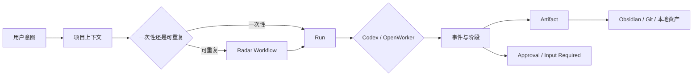

# Personal OS：AI Runtime 可视控制层改造计划

**状态**：Implemented and verified
**日期**：2026-07-30
**产品定位**：Codex 与 OpenWorker 之上的本地可视控制层

## 1. 一句话发布说明

Personal OS 将不再要求用户维护另一套任务看板。用户只需要描述要完成的工作、选择项目与 Runtime；系统负责把 Codex/OpenWorker 的执行上下文、当前阶段、工具能力、阻塞、审批、结果和沉淀资产统一可视化，并让可重复流程进一步固化为 Radar Skill。

## 2. 问题定义

当前产品已经具备项目、任务、Radar、Agent Run、审批、Obsidian 和资产能力，但信息架构仍以传统任务管理器为中心：

| 当前表面 | 已有价值 | 当前问题 |
|---|---|---|
| 总览 | 汇总项目、任务与部分结果 | 仍以任务数量为主，不能快速解释 Runtime 此刻在做什么 |
| 任务队列 | 编辑任务、拖拽状态、设置定时、派发 Agent | 用户不需要维护 Kanban；状态与 Agent Run、Radar Run 重复 |
| 项目 | 保存 Git、Obsidian 与任务上下文 | 缺少统一的运行时间线、产物和上下文入口 |
| Radar | 定义、预执行、Skill、定时与结果 | 是正确方向，但 Runtime 能力、Skill 来源和产物关系仍不完整 |
| Agent 控制 | 运行、审批与验收 | 与任务详情、Radar 运行记录重复，名称也没有体现统一 Runtime 视角 |
| 实验室 / 收入资产 | 记录业务实验和收入资产 | 作为一级导航过重，更适合成为项目或成果的类型化视图 |

用户已明确指出“任务队列没有用”。这不是需要优化拖拽体验，而是产品定位发生了校正：Personal OS 的核心对象应是 Workflow、Run、Artifact 和 Approval，而不是用户手工维护的 Task Status。

## 3. 产品目标与成功指标

### 北极星指标

任一正在运行或最近完成的 Codex/OpenWorker 工作，都能在两次点击内回答五个问题：谁在执行、为什么执行、执行到哪、卡在哪里、产生了什么。

### MVP 指标

| 目标 | 基线 | 目标值 | 验证窗口 |
|---|---:|---:|---|
| 一级导航数量 | 7 | 5 | 改造上线时 |
| 同一 Run 的重复主入口 | 最多 3 个 | 1 个权威运行详情 | 改造上线时 |
| 活跃 Run 状态可见性 | 分散 | 100% Codex/OpenWorker 活跃 Run 可见 | 每次运行 |
| Runtime/Skill/项目/产物关联 | 部分可见 | 100% Run 有完整来源链 | 每次运行 |
| 定时配置权威入口 | 任务与 Radar 并存 | Radar 单一入口 | 改造上线时 |
| 手工维护 Task 状态 | 必需 | 日常路径为 0 | 上线后 7 天 |

## 4. 非目标

- 不删除 `tasks` 表或历史任务数据；它继续作为内部调度兼容层。
- 不重新实现 Codex 或 OpenWorker 自己的对话 UI、终端或文件编辑器。
- 不引入多人协作、团队权限、工单分派或企业项目管理。
- 不让前端绕过 Runtime 直接执行高风险外部动作。
- 不在本阶段重做视觉品牌；先完成对象、导航和状态真相收敛。

## 5. 新的核心对象

| 用户概念 | 系统含义 | 当前数据来源 | 迁移策略 |
|---|---|---|---|
| Workflow | 可重复、有步骤、可预执行、可定时的工作 | Radar Definition + Skill Version | Radar 成为唯一可重复工作入口 |
| Run | Codex/OpenWorker 的一次真实执行 | Agent Run / Codex Run / events | 合并为统一运行详情与时间线 |
| Artifact | 运行产生的文件、报告、Obsidian、Git 结果 | artifact paths + project links | 建立统一产物索引和可预览入口 |
| 经营单元与账本 | 某个项目、Radar、产品或实验的现金投入、产出与时间投入 | income assets + new ledger entries | 在资产内建立实际/预计分离的投入产出账本 |
| Approval | 需要用户决定的风险动作或最终验收 | approvals + review state | 汇总到“今日”和“运行” |
| Project Context | Runtime 执行所需的仓库、目标、记忆与约束 | Project + Git + Obsidian | 项目页变成上下文与运行时间线 |
| Runtime Capability | Codex/OpenWorker 当前可使用的工具和限制 | health check + tool manifest + preflight | 在运行前、运行中和失败时可见 |

`Task` 不再作为一级用户概念。一次性工作从“发起运行”创建，系统可以继续在后台生成兼容 Task 记录，但用户不需要拖动或维护它。

## 6. 新信息架构

一级导航固定为五项：

1. **今日**：需要关注的审批、异常、等待输入、正在执行和最近完成。
2. **项目**：Git 仓库、目标、Obsidian、关联 Workflow、运行时间线和产物。
3. **雷达**：可重复 Workflow 的定义、Runtime、预执行、Skill、定时与报告。
4. **运行**：Codex/OpenWorker 的统一运行列表与详情，替代“Agent 控制”和任务运行状态。
5. **资产**：成果库与投入产出账本，统一管理报告、Obsidian、代码、Skill、经营单元、成本、收入和其他可复用成果。

Runtime 状态、设置与主题放入页头，不占一级导航。实验室与收入资产作为“资产”筛选项或项目子视图，不再独立占用一级导航。

## 7. 页面规格

### 7.1 今日

- 顶部提供“发起运行”输入框：目标、项目、Runtime（自动/Codex/OpenWorker）、验收条件。
- 第一优先级显示等待批准、等待输入和失败恢复。
- 第二优先级显示正在运行，包含当前阶段、耗时、Runtime 与最近事件。
- 第三优先级显示今日完成及其产物。
- 不显示 Kanban 列、任务总数或需要用户维护的流程状态。

### 7.2 项目

- 项目首页显示目标、仓库、Obsidian、默认 Runtime、关联 Skill 和最近活动。
- 项目详情按“运行 / Workflow / 产物 / 上下文”组织。
- 一次性运行从项目上下文直接发起，不要求先创建任务卡片。

### 7.3 雷达

- 保留当前 Radar 控制面与独立工作区。
- 定义页显示首选 Runtime、备用策略和步骤级 Runtime。
- 预执行显示能力清单，而不只显示“就绪/失败”。
- Skill 页显示来源仓库、文件路径、版本、哈希、验证证据和当前生产绑定。
- 定时页是所有可重复任务的唯一调度入口。
- 结果页统一显示报告、Obsidian、Git/文件产物及覆盖状态。

### 7.4 运行

- 合并 Agent 控制、任务详情中的 Run 和 Radar Run 历史。
- 列表按“正在执行 / 需要关注 / 已完成”分组，而不是按 Task Status 分组。
- 详情必须展示：项目、Workflow/一次性目标、Runtime、Thread ID、工作目录、Skill 版本、步骤、工具能力、事件流、恢复尝试、审批、结果、验证和产物。
- Codex/OpenWorker 使用同一信息结构；Runtime 特有字段作为扩展区展示。

### 7.5 资产

- 聚合 Markdown 报告、Obsidian 笔记、代码修改、截图、研究证据、实验和收入资产。
- 每个产物反向链接到 Project、Workflow、Run 和创建 Runtime。
- 默认只索引路径与元数据，不复制 Git 或 Obsidian 内容到 SQLite。
- 内部分为“成果库”和“投入产出”两个主视图；账本详细规格见 [ASSET-ROI-LEDGER-PLAN.md](ASSET-ROI-LEDGER-PLAN.md)。
- 投入产出按经营单元汇总实际投入、实际产出、净现金收益、现金 ROI、回本进度和独立的时间投入。
- 预计收入、待支付成本和金额未知的 Runtime 用量不得混入实际汇总。
- Project、Radar、Run 与 Artifact 都能反查所属经营单元和相关账目。

## 8. Runtime 能力可视化

| 能力 | 当前状态 | 目标呈现 |
|---|---|---|
| Runtime 在线状态 | 健康检查部分可见 | 页头常驻状态与详情抽屉 |
| Codex/OpenWorker 路由 | Radar 部分可见 | 每个 Run 清晰显示选择理由 |
| 工具清单 | 不完整 | 显示 Shell、Web、ADB、图片、MCP 等能力及来源 |
| Capability mismatch | 主要是错误文本 | 显示缺失能力、可选 Runtime 和恢复动作 |
| Skill 来源与版本 | Radar Skill 页部分可见 | 路径、哈希、验证、绑定和变更记录完整可见 |
| Thread / 工作目录 | 后端已有部分字段 | Run 详情固定显示 |
| 实时事件 | Agent 控制部分可见 | 所有 Runtime 统一时间线 |
| 产物 | 路径分散 | 统一 Artifact 区域，可打开原文件 |
| 成本与耗时 | 不完整 | Run 顶部统一统计，可为空但不能伪造 |

## 9. 任务队列退役策略

1. 从一级导航移除“任务”。
2. `/tasks` 暂时重定向到 `/runs`，保留一个版本的兼容入口。
3. 保留任务 API、数据库和调度器，避免破坏现有 Radar、定时任务和历史 Run。
4. 新增“一次性运行请求”，后台按需创建兼容 Task + Run，但不暴露 Kanban 状态编辑。
5. 定时任务迁移到对应 Radar；没有 Workflow 定义的定时任务先显示为“待迁移自动化”。
6. 项目页不再显示任务卡片，改为运行时间线和“发起运行”。
7. 经过一个稳定版本后再评估删除 TasksPage 组件；历史数据永不随 UI 退役而删除。

## 10. 实施阶段

### Phase 0：能力真相沉淀（现在）

- 将汽水音乐官方下载验证结果写回 Radar：官方离线下载成功不等于可分析文件。
- 固化 `available / login_required / vip_required / protected_storage / no_exportable_file` 状态。
- Skill 和 Radar 都必须把截图、客户端提示、共享目录检查与 `ffprobe` 作为证据链。

### Phase 1：导航与运行主线（优先，1 个实施批次）

- 新建统一 `/runs` 页面并迁移 Agent 控制能力。
- 从一级导航移除任务、实验室和收入资产。
- 将 `/tasks` 重定向到 `/runs`；数据与 API 不删除。
- 今日页改为关注项、活跃 Run 和最近产物。
- 完成桌面、移动、浅色、深色和键盘导航验收。

### Phase 2：Runtime 与能力面板（第二批次）

- 建立 Runtime health/tool manifest 接口。
- 在页头、预执行和 Run 详情展示能力、选择理由与 mismatch。
- 统一 Codex/OpenWorker 事件与状态文案。
- 显示 Thread ID、工作目录、Skill 版本和恢复链。

### Phase 3：产物与记忆闭环（第三批次）

- 建立 Artifact 索引和反向关系。
- 合并实验室、收入资产与现有文件产物到“资产”。
- 增加“投入产出”账本：经营单元、成本、收入、时间、分摊、冲销、回本和 ROI。
- 支持从 Project、Radar、Run 和 Artifact 归集或登记账目；实际与预计严格分离。
- 项目页增加运行、Workflow、产物和上下文四个子视图。
- Obsidian 与 Git 继续作为内容权威来源，SQLite 只保存结构和链接。

### Later

- 跨 Runtime 的价格目录、预算预警与 token 成本预测；MVP 只归集 Runtime 明确返回的实际费用。
- 跨 Run 的可复用上下文建议。
- OpenWorker 本地设备/图片能力接入后的能力动态路由。

## 11. 技术边界与迁移

- 保持 `AgentRun` 为统一运行读取模型；旧 `CodexRun` 只作为兼容投影逐步收敛。
- 所有状态变换继续位于 domain/database，React 不自行推导持久状态。
- 新增 Run Request API，内部复用 Dispatcher，不让浏览器直接调用 Runtime。
- Runtime manifest 必须来自服务端实际健康检查，不能由前端配置假装可用。
- 路由迁移必须可回滚：恢复旧导航即可访问保留的 TasksPage 与原数据。
- 不做破坏性迁移，不删除任务、运行、审批、实验、资产或历史事件。

## 12. 实施验收

权威验收清单见 [AI-RUNTIME-CONTROL-LAYER-ACCEPTANCE.md](AI-RUNTIME-CONTROL-LAYER-ACCEPTANCE.md)。在所有必需项通过前，本计划保持 Proposed，不将任务队列物理删除。
