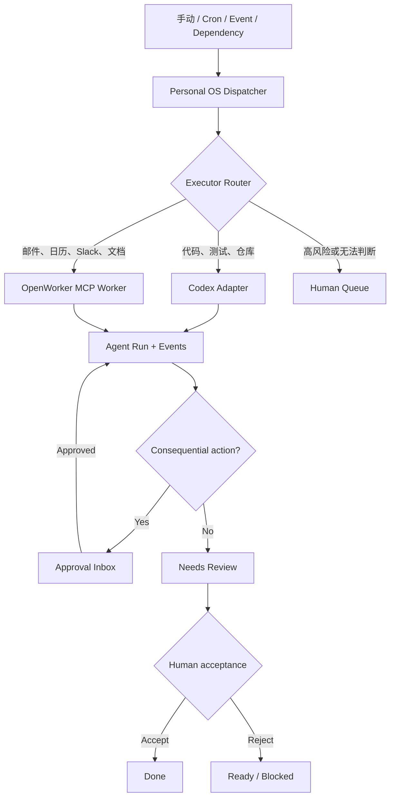

# Personal OS 自动多执行器计划

Status: Approved for implementation  
Date: 2026-07-28  
Target: MVP2 — Automated Agent Dispatch  
Method: Plan -> Implement -> Verify -> Human Review

Environment baseline: OpenWorker 已完成本机源码安装并通过启动验证；Personal OS 与 OpenWorker 的自动领取、审批和结果回传尚未实现。

## 1. 目标

让 Personal OS 成为个人工作的唯一控制中心，根据任务类型、风险和触发条件，自动把工作交给 Codex、OpenWorker 或本人，并把所有执行结果统一送回人工验收。

目标闭环：

```text
创建任务或触发自动化
  -> Personal OS 判断执行时间和执行者
  -> 原子领取任务并创建 Agent Run
  -> Codex 或 OpenWorker 执行
  -> 执行事件、审批请求和产物持续回传
  -> 任务进入 Needs Review
  -> 人工批准后进入 Done
```

MVP2 的重点是“自动调度、受控执行、统一验收”，不是让 Agent 不受限制地替用户做决定。

## 2. 架构原则

1. **Personal OS 是控制平面。** 项目、任务、路由、运行记录和最终验收以 Personal OS 为准。
2. **执行引擎保持独立。** Codex 和 OpenWorker 不合并进 Personal OS 源码。
3. **产品体验融合。** 用户从 Personal OS 创建、观察、审批和验收任务，不需要理解底层执行器细节。
4. **低风险任务可自动执行。** 付款、购买、外联、发布、生产部署等后果性操作必须人工批准。
5. **所有执行可追踪。** 每次领取、重试、工具请求、产物和失败都必须关联到一个 `AgentRun`。
6. **失败必须可恢复。** 使用租约、幂等键、有限重试和超时，避免任务重复执行或永久卡死。
7. **先 MCP，后稳定 API。** OpenWorker 第一阶段通过 Personal OS MCP 领取任务；只有其任务提交 API 稳定后才增加主动推送适配器。

## 3. 当前基础与缺口

### 已具备

- Web 可以把 `Ready` 任务交给 `CodexOrchestrator`。
- Live 模式通过 `@openai/codex-sdk` 启动或恢复 Codex thread。
- Codex 结果、文件路径和验证摘要会持久化并进入 `Needs Review`。
- Personal OS 已提供本地 STDIO MCP Server。
- MCP 已能读取项目与任务、更新状态、保存产物和提交人工审查。
- SQLite 已启用 WAL，可支持本地 Server 与 MCP 进程并发访问。
- 每日机会雷达已具备本地定时任务模式，可复用其调度基础。

### 需要补齐

- `tasks` 只有委派模式，没有明确的执行器、自动执行和触发规则。
- `codex_runs`、事件和部分 MCP 工具仍是 Codex 专用命名。
- 缺少通用 Dispatcher、任务租约、心跳、超时和重试机制。
- 缺少 OpenWorker 领取任务与回传结果的正式契约。
- 缺少统一的审批 Inbox 和自动化运行页面。
- 本地 Server 停止或电脑休眠时，定时任务不会运行，也不会自动补跑。

### OpenWorker 本机安装基线

OpenWorker 保持为独立执行器，不复制或合并进 Personal OS 仓库。当前机器已经完成源码安装，后续 Phase C 在此安装实例上配置 Personal OS MCP。

#### 安装位置与运行方式

| 项目 | 当前值 |
|---|---|
| OpenWorker 仓库 | `/Users/frigidcrow/Documents/Codex/dev/openworker` |
| Python 环境 | OpenWorker 仓库内 `.venv`，Python 3.12 |
| OpenWorker 工作目录 | `/Users/frigidcrow/Documents/Codex/dev/personal-os` |
| OpenWorker 运行方式 | Python local agent server + React/Vite browser GUI |
| 模型认证 | 由用户在 OpenWorker Settings 中配置，不写入 Personal OS、Git 或本文档 |

当前采用源码开发运行方式，不是已打包的 macOS `.app`。开发进程关闭或电脑重启后需要重新启动；登录自动启动留到 Phase E 的 LaunchAgent 实现。

#### 本机端口约定

| 服务 | 地址 | 约束 |
|---|---|---|
| Personal OS Web | `http://127.0.0.1:5273` | 保留现有端口 |
| Personal OS API | `http://127.0.0.1:8787` | 保留现有端口 |
| OpenWorker Web | `http://127.0.0.1:5274` | 不使用已被其他项目占用的 5173 |
| OpenWorker agent server | `http://127.0.0.1:8765` | 健康检查为 `/v1/health` |

所有服务默认只监听 `127.0.0.1`。在身份认证、来源校验和远程访问策略完成前，不允许绑定 `0.0.0.0`、局域网地址或公网地址。

#### 启动命令

终端一启动 OpenWorker agent server：

```bash
cd /Users/frigidcrow/Documents/Codex/dev/openworker
.venv/bin/openworker-server \
  --cwd /Users/frigidcrow/Documents/Codex/dev/personal-os \
  --host 127.0.0.1 \
  --port 8765
```

终端二启动 OpenWorker Web：

```bash
cd /Users/frigidcrow/Documents/Codex/dev/openworker/surfaces/gui
NODE_OPTIONS=--no-experimental-webstorage \
  npm run dev -- --host 127.0.0.1 --port 5274
```

`NODE_OPTIONS=--no-experimental-webstorage` 用于规避当前 Node 25 实验性 Web Storage 与 OpenWorker/Vitest 的 `localStorage` 冲突；切换到项目兼容的 Node 22 后可以重新验证是否仍然需要。

#### 当前安装验证

- `GET http://127.0.0.1:8765/v1/health` 返回 `{"status":"ok"}`。
- Python 后端测试：930 passed，1 skipped。
- GUI 测试：74 passed。
- GUI TypeScript 与 Vite 生产构建通过。
- Python `pip check` 无缺失或冲突依赖。
- OpenWorker Git 工作区保持干净，没有修改上游源码。

GUI 当前依赖审计报告 7 项上游告警：3 moderate、3 high、1 critical，主要涉及 Vite/Vitest 开发工具及 `xlsx`。本机开发服务保持 loopback-only；在评估上游兼容性前不执行 `npm audit fix --force`。处理不可信电子表格文件前必须单独评估 `xlsx` 风险。

#### 集成状态

安装成功不代表 OpenWorker 自动化链路已经完成。当前只证明 OpenWorker 可以独立启动、构建和运行；以下能力仍属于 Phase A 至 Phase D：

- Personal OS 通用 `AgentRun`、租约和幂等模型。
- OpenWorker 的 `list_claimable_tasks`、`claim_task`、心跳和结果回传 MCP 契约。
- Personal OS Approval Inbox。
- OpenWorker 定时领取任务与真实端到端验收。

不得因为 OpenWorker 已安装而跳过 Phase A 与 Phase B，直接把 Codex 专用数据结构复制成 OpenWorker 专用结构。

## 4. 目标架构



### 组件边界

| 组件 | 责任 |
|---|---|
| Personal OS Web | 创建任务、配置自动化、查看运行、审批与验收 |
| Dispatcher | 扫描可执行任务、选择执行器、创建运行、超时与重试 |
| Executor Router | 根据显式配置、任务类型和项目上下文决定执行器 |
| Codex Adapter | 调用现有 Codex SDK，执行代码仓库任务 |
| OpenWorker Worker | 通过 MCP 领取通用事务任务，调用 Connector 并回传结果 |
| Personal OS MCP | 提供任务领取、心跳、事件、审批、产物和结果工具 |
| SQLite | 项目、任务、运行、租约、审批和自动化的权威状态 |

## 5. 数据模型

### 5.1 Task 扩展

新增字段：

```ts
type Executor = "auto" | "human" | "codex" | "openworker";
type ExecutionMode = "manual" | "automatic";
type TriggerType = "manual" | "cron" | "event" | "dependency";
type RiskLevel = "low" | "medium" | "high";

interface TaskAutomation {
  executor: Executor;
  executionMode: ExecutionMode;
  triggerType: TriggerType;
  triggerConfig: Record<string, unknown> | null;
  riskLevel: RiskLevel;
  maxAttempts: number;
  nextRunAt: string | null;
}
```

默认值必须保持现有行为：

- `executor = "human"`
- `executionMode = "manual"`
- `triggerType = "manual"`
- `riskLevel = "medium"`
- `maxAttempts = 1`

现有 `delegationMode` 在迁移期保留，用于兼容当前 UI；后续由 `executionMode` 与 `executor` 取代。

### 5.2 通用 AgentRun

将 `codex_runs` 泛化为 `agent_runs`：

```ts
interface AgentRun {
  id: string;
  taskId: string;
  projectId: string | null;
  executor: "codex" | "openworker";
  externalSessionId: string | null;
  status: "queued" | "claimed" | "running" | "awaiting_approval" | "needs_review" | "done" | "blocked" | "failed" | "cancelled";
  attempt: number;
  idempotencyKey: string;
  promptSnapshot: string;
  workingDirectory: string | null;
  finalResponse: string | null;
  artifactPaths: string[];
  verificationSummary: string | null;
  errorMessage: string | null;
  claimedAt: string | null;
  leaseExpiresAt: string | null;
  heartbeatAt: string | null;
  startedAt: string | null;
  completedAt: string | null;
}
```

迁移要求：

- 保留现有 Codex 历史记录和 thread id。
- 旧的 `/api/codex/runs` 在迁移期保留兼容层。
- 新代码只写入 `agent_runs`。
- UI 在迁移期间能同时读取旧记录和新记录，完成数据迁移后删除兼容层。

### 5.3 运行事件

`agent_run_events` 记录：

- `queued`
- `claimed`
- `running`
- `heartbeat`
- `tool_request`
- `approval_requested`
- `approval_resolved`
- `artifact_saved`
- `verification`
- `needs_review`
- `failed`
- `cancelled`

事件只保存可审查摘要，不默认复制 OpenWorker 或 Codex 的完整私密对话。

### 5.4 审批请求

新增 `approval_requests`：

```ts
interface ApprovalRequest {
  id: string;
  runId: string;
  actionType: "send_message" | "calendar_write" | "publish" | "shell" | "external_write" | "other";
  destination: string;
  summary: string;
  payloadPreview: string | null;
  status: "pending" | "approved" | "rejected" | "expired";
  expiresAt: string | null;
  resolvedAt: string | null;
}
```

审批和最终验收是两件事：执行中的后果性操作需要审批，执行完成后仍必须人工验收结果。

## 6. 状态机与任务租约

### Task 状态

继续使用：

```text
Inbox -> Ready -> In Progress -> Needs Review -> Done
                     |                |
                     v                v
                  Blocked <-----------
```

### AgentRun 状态

```text
queued -> claimed -> running -> needs_review -> done
                         |
                         +-> awaiting_approval -> running
                         +-> blocked
                         +-> failed
                         +-> cancelled
```

### 租约规则

- `claim_task` 必须在单个数据库事务内检查和写入租约。
- 同一任务同一时间最多存在一个活跃运行。
- Worker 每 30 秒发送一次心跳，默认租约 2 分钟。
- 租约过期后 Dispatcher 才能回收任务。
- 回收后增加 `attempt`，使用新的 run id，但保留同一个任务 id。
- 达到 `maxAttempts` 后进入 `Blocked`，不得无限重试。
- 每次分派生成唯一 `idempotencyKey`，适配器必须拒绝重复执行同一个键。

## 7. 执行器路由

路由优先级：

1. 用户明确选择的 `executor`。
2. 项目或自动化规则指定的默认执行器。
3. `executor = "auto"` 时使用确定性规则。
4. 规则无法确认时进入 Human Queue，不调用模型猜测执行器。

初始自动规则：

```ts
if (task.riskLevel === "high") return "human";

if (
  project.repositoryPath &&
  ["coding", "testing", "code_review", "technical_docs"].includes(task.type)
) return "codex";

if (
  ["email", "calendar", "slack", "notion", "business_report", "general_writing"].includes(task.type)
) return "openworker";

return "human";
```

第一版路由保持白名单制，不允许模型自行扩大权限或选择未声明工具。

## 8. 执行器接口

所有执行器实现同一个接口：

```ts
interface ExecutorAdapter {
  readonly executor: "codex" | "openworker";
  healthCheck(): Promise<ExecutorHealth>;
  canHandle(context: TaskExecutionContext): Promise<boolean>;
  dispatch(context: TaskExecutionContext): Promise<DispatchResult>;
  cancel?(runId: string): Promise<void>;
}
```

### Codex Adapter

- 复用现有 `CodexOrchestrator` 和 `@openai/codex-sdk`。
- 从通用 `AgentRun` 创建或恢复 Codex thread。
- 保留项目 Git 仓库检查、workspace-write sandbox 和人工验收。
- 自动运行仅允许已绑定真实仓库、验收条件非空的低风险任务。
- Live 执行默认继续禁用网络，除非任务显式声明并通过安全策略。

### OpenWorker Adapter — 第一阶段

OpenWorker 通过定时自动化调用 Personal OS MCP：

```text
1. list_claimable_tasks(executor="openworker")
2. claim_task(taskId)
3. get_execution_context(runId)
4. heartbeat_run(runId)
5. append_run_event(runId, ...)
6. request_approval(runId, ...) when needed
7. save_artifact(runId, ...)
8. submit_run_result(runId, ...)
```

这是一种 Pull Worker 模式。Personal OS 不依赖 OpenWorker 内部未稳定的私有 API。

### OpenWorker Adapter — 后续阶段

只有满足以下条件才增加主动推送：

- OpenWorker 发布稳定、受支持的任务提交接口或 SDK。
- 接口支持身份验证、幂等键、取消和状态查询。
- 升级不会要求复制或 Fork OpenWorker 源码。

## 9. MCP 契约

新增或泛化以下工具：

| Tool | 作用 | 权限 |
|---|---|---|
| `list_claimable_tasks` | 返回指定执行器可领取的任务 | Read |
| `claim_task` | 原子创建运行并写入租约 | Write |
| `get_execution_context` | 返回任务、项目、验收和安全策略 | Read |
| `heartbeat_run` | 延长有效租约 | Write |
| `append_run_event` | 写入简短执行事件 | Write |
| `request_approval` | 创建后果性操作审批请求 | Write |
| `get_approval_status` | 查询审批结果 | Read |
| `save_artifact` | 关联本地产物路径 | Write |
| `submit_run_result` | 提交结果并进入 Needs Review | Write |
| `fail_run` | 记录失败并应用重试策略 | Write |

MCP 不提供：

- 直接把任务标记为 `Done`
- 付款、购买或转账
- 无审批发送外部消息
- 无审批发布内容
- 无审批生产部署
- 读取其他执行器的秘密、Token 或完整私密 Transcript

## 10. 触发器与 Dispatcher

### 支持的触发器

- `manual`：用户点击运行。
- `cron`：按时区执行的 Cron 表达式。
- `event`：由 Personal OS 内部事件触发，例如机会进入 shortlisted。
- `dependency`：指定任务通过人工验收后触发。

### Dispatcher 循环

```text
加载到期自动化
  -> 生成或激活任务
  -> 验证任务、项目、验收条件和风险
  -> 选择执行器
  -> 原子创建 queued run
  -> Codex 立即 dispatch，OpenWorker 等待 claim
  -> 监控心跳、租约、超时和审批
  -> 应用重试或 Blocked 策略
```

### 本地运行约束

- MVP2 Dispatcher 仍运行在本地 Server 进程中。
- Server 或电脑停止时不承诺实时执行。
- Cron 必须记录 `lastScheduledAt` 和 `nextRunAt`。
- 默认不补跑所有错过周期，只补跑最近一次且需要显式配置 `catchUp = true`。
- 后续可增加 macOS LaunchAgent，让 Personal OS 登录后自动启动。

## 11. 安全与自动化策略

### 风险分级

| Risk | 自动化规则 |
|---|---|
| Low | 可自动领取和执行，结果进入人工验收 |
| Medium | 可自动准备草稿或本地文件；外部写操作必须审批 |
| High | 不自动分派，必须人工确认执行器和范围 |

### 永久人工闸门

以下操作默认永远需要即时人工批准：

- 付款、购买、订阅或财务转移
- 发送邮件、私信或公开回复
- 新建或修改对外日历邀请
- 发布、投放广告或公开部署
- 修改生产数据或生产配置
- 处理密码、OTP、支付信息或高敏感个人信息

批准某一步操作不等于接受最终任务结果。

## 12. Web 产品改动

### 任务创建与详情

- 执行者：Auto / Human / Codex / OpenWorker
- 执行方式：Manual / Automatic
- 触发器和时区
- 风险级别
- 最大尝试次数
- 自动执行的安全说明

### 任务队列

- 显示执行者图标和自动化标记。
- 显示 queued、claimed、running、awaiting approval 等运行状态。
- 支持暂停自动执行、取消未开始运行和手动重试。
- 自动路由结果必须可见，不能静默选择执行器。

### Agent Runs

- 统一展示 Codex 与 OpenWorker。
- 时间线展示领取、心跳、审批、产物、验证和失败。
- 展示执行器健康状态和外部 session id。
- 失败时展示是否会重试、下次重试时间和剩余次数。

### Approval Inbox

- 明确展示执行器、目标系统、动作和数据预览。
- Approve / Reject 必须是显式操作。
- 审批过期后默认拒绝，不自动继续。
- 审批记录不可由 Agent 修改或删除。

## 13. 分阶段实施

### Phase A — 通用运行模型

- 新增 executor、execution mode、trigger、risk 和 retry schema。
- 创建 `agent_runs`、`agent_run_events`、`approval_requests`。
- 迁移 `codex_runs` 历史数据。
- 建立兼容读取层。

Gate:

- 数据库迁移在现有数据库和空数据库上都通过。
- 所有旧 Codex 运行可读取。
- 非法状态转换、重复活跃运行和重复 idempotency key 被拒绝。

### Phase B — Dispatcher 与 Codex 自动执行

- 实现 Dispatcher、Router、租约与重试。
- 将现有 CodexOrchestrator 适配到 `ExecutorAdapter`。
- 支持低风险 Codex 任务自动 dispatch。
- 增加暂停、取消和 Blocked 流程。

Gate:

- 自动 Codex demo 任务完整通过 Ready -> Running -> Needs Review。
- Live 任务仍受仓库、sandbox 和验收条件限制。
- Server 重启后不会重复执行已完成或已有有效租约的任务。

### Phase C — OpenWorker MCP Worker

- 新增领取、心跳、审批和结果 MCP 工具。
- 在 OpenWorker 配置 Personal OS MCP。
- 创建定时领取自动化。
- 运行一个无外部写操作的真实 OpenWorker 任务。

Gate:

- OpenWorker 能原子领取唯一任务。
- 心跳能延长租约，停止心跳能触发安全回收。
- 结果和本地产物进入 Personal OS Needs Review。
- 外部发送或写操作会创建 Approval Request，而不是直接执行。

### Phase D — Web 控制与审批

- 任务自动化表单。
- 统一 Agent Runs 页面。
- Approval Inbox。
- 重试、暂停、取消和验收交互。

Gate:

- 用户无需打开数据库或终端即可理解每项自动运行。
- 键盘和移动端可以完成审批与验收。
- Demo、Live、Codex、OpenWorker 状态不会混淆。

### Phase E — 可靠运行

- macOS LaunchAgent 安装与卸载脚本。
- 健康检查、运行卡死检测和可恢复错误分类。
- 数据备份、保留策略和隐私清理。
- 定时任务 catch-up 策略。

Gate:

- 登录后可自动启动 Personal OS。
- 进程重启不会丢失运行状态或重复产生外部影响。
- 所有失败都能在 Web 中看到原因和下一步。

## 14. 验收场景

### A. 自动 Codex 任务

1. 创建一个绑定 Git 仓库、有明确验收条件的低风险编码任务。
2. 设置 `executor=codex`、`executionMode=automatic`。
3. Dispatcher 自动创建运行并调用 Codex。
4. Codex 修改文件并运行验证。
5. 结果进入 Needs Review，不自动 Done。

### B. 自动 OpenWorker 晨报

1. 创建每天 08:00 的晨报自动化。
2. OpenWorker 自动领取任务。
3. 只读取允许的本地或 Connector 数据。
4. 生成 Markdown 晨报并提交结果。
5. 不发送任何外部消息。
6. Personal OS 展示产物并等待验收。

### C. 审批阻断

1. OpenWorker 尝试发送一条 Slack 回复。
2. 运行进入 Awaiting Approval。
3. 用户拒绝。
4. 消息没有发送，运行记录拒绝原因。
5. 任务进入 Needs Review 或 Blocked，由策略决定。

### D. Worker 崩溃

1. OpenWorker 领取任务后停止心跳。
2. 租约过期前其他 Worker 不能领取。
3. 租约过期后 Dispatcher 安全回收。
4. 未达到最大次数时重新排队；达到上限时 Blocked。

## 15. 自动化测试计划

- Domain：路由、状态机、风险策略、Cron 解析。
- Database：迁移、租约原子性、幂等、并发领取、重试上限。
- API：创建自动化、暂停、取消、审批和人工验收。
- MCP：领取、心跳、审批、提交、失败和权限边界。
- Codex Adapter：demo、live 前置校验、失败恢复。
- OpenWorker Contract：使用确定性 fake worker 完成完整 Pull 流程。
- Scheduler：时区、重复 tick、错过周期和 catch-up。
- Web：自动化表单、运行时间线、审批 Inbox、错误状态。
- E2E：Codex 自动任务、OpenWorker fake task、审批拒绝、租约过期。

每个阶段必须通过：

```bash
npm test
npm run typecheck
npm run lint
npm run build
```

## 16. 非目标

- 把 OpenWorker 源码、Tauri 壳、密钥库或 Connector 复制进 Personal OS。
- 让 Agent 绕过 OpenWorker 或 Personal OS 的审批系统。
- 自动支付、购买、外联、发布或生产部署。
- 在 MVP2 中实现多用户和远程公网控制。
- 复制 Codex/OpenWorker 的全部原始对话和敏感工具参数。
- 让模型动态生成新的权限策略。
- 因为自动化而取消最终人工验收。

## 17. Definition of Done

MVP2 完成必须同时满足：

1. Personal OS 能自动选择或遵循显式执行器。
2. Codex 和 OpenWorker 使用统一任务、运行、事件和验收模型。
3. Codex 可以由 Dispatcher 自动启动。
4. OpenWorker 可以通过 MCP 自动领取并完成任务。
5. 同一任务不会被两个 Worker 重复执行。
6. 运行崩溃、超时和有限重试可恢复且可见。
7. 后果性外部操作一定进入 Approval Inbox。
8. Agent 不能自行把任务标记为 Done。
9. Web 能查看所有运行、产物、审批和失败原因。
10. 自动化测试、类型检查、Lint 和生产构建通过。
11. Codex 和 OpenWorker 各完成至少一个真实端到端验收场景。
12. 安装、启动、OpenWorker MCP 和故障恢复步骤有文档。

## 18. 实施顺序决定

立即实施顺序固定为：

```text
通用 AgentRun
  -> Dispatcher + Codex 自动执行
  -> OpenWorker MCP Pull Worker
  -> Approval Inbox
  -> 可靠启动与恢复
```

不在通用运行模型完成前直接接 OpenWorker；否则会把 Codex 专用结构复制成第二套并行系统，增加后续迁移成本。
