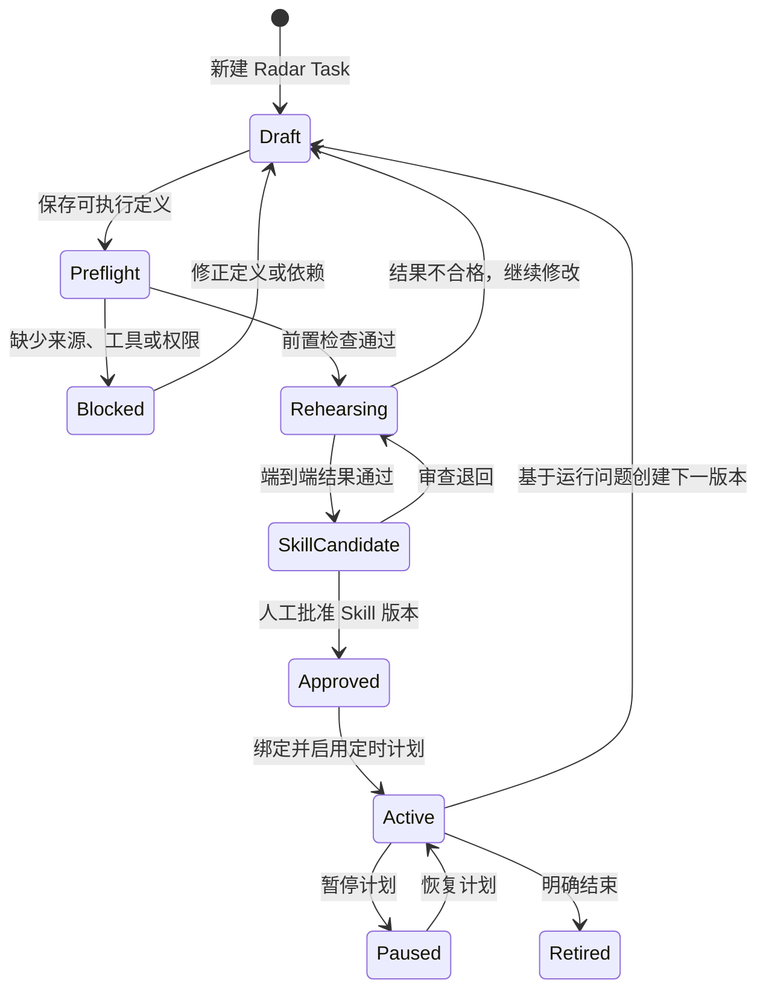
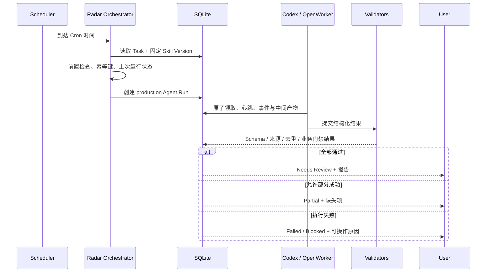

# Personal OS「雷达」平台设计

Status: Implemented and verified for Phases 1-3; Phase 4 deferred
Date: 2026-07-29
Scope: Product and technical design plus the delivered Phases 1-3 contract. Conditional DAG/parallel orchestration remains deferred.

## 1. 一句话定义

「雷达」是 Personal OS 中管理持续研究型自动化的控制台：用户先定义一个 Radar Task，在预执行实验室中把流程跑通，再把已验证流程沉淀为有版本、可审计的 Skill，最后让定时器固定使用某个已批准的 Skill 版本重复运行。

它解决的不是“再加一个定时任务入口”，而是下面这条可靠闭环：

```text
想法 / 要求
  -> Radar Task 草稿
  -> 前置检查
  -> 预执行与调试
  -> 程序校验 + 人工验收
  -> Skill 草稿
  -> Skill 版本批准
  -> 定时运行
  -> 运行报告、失败恢复和持续改版
```

## 2. 要解决的问题

目前机会雷达是一个特制功能，AI 新闻是一个通用 Cron Task。继续为每个新需求复制一套页面、调度和提示词，会出现四个问题：

1. 用户看不到一个复杂任务到底执行到哪一步、为何失败。
2. 未验证的提示词可以直接进入每日自动化，失败会每天重复发生。
3. 一次成功的调试过程没有被结构化沉淀，下一次仍依赖模型临场发挥。
4. 修改提示词会直接改变生产运行，缺少版本、回滚和可比较证据。

「雷达」把探索、验证、固化和生产运行分开，让复杂任务先在安全环境中证明自己，再获得定时执行资格。

## 3. 产品边界

### 3.1 雷达负责什么

雷达只管理持续观察、检索、分析和报告类任务，例如：

- 赚钱机会扫描与深度验证；
- AI 新闻与新技术晨报；
- 行业、竞品、价格或政策变化追踪；
- 汽水音乐榜单观察、合法素材分析与 Suno 原创提示包；
- 已有项目的需求、Issue 或舆情信号监控。

### 3.2 雷达不负责什么

- 普通的一次性编码、杂事和客户交付仍在「任务队列」。
- 付款、购买、外联、发布、登录新账户和生产部署不能被 Skill 自动授权。
- Skill 不保存 API Key、Cookie、Token 或验证码。
- “执行成功”不等于“内容正确”；高价值结果仍进入 Needs Review。

### 3.3 与通用 Task 的关系

Radar Task 不另造一套任务调度底座。它复用现有 `tasks`、`agent_runs`、租约、重试、审批和 Cron 能力，并增加一对一的研究定义与 Skill 绑定。

```text
Task                    负责归属、执行器、时间、风险和生命周期
Radar Definition        负责研究目标、输入、步骤、输出契约和校验规则
Agent Run               负责一次真实执行及其事件、产物和错误
Skill Version           负责已经验证并批准的稳定执行协议
Schedule Binding        负责指定“每天运行哪个 Skill 版本”
```

## 4. 核心概念

### 4.1 Radar Task

Radar Task 表达“我要持续得到什么结果”，允许频繁修改。至少包含：

- 名称与业务目标；
- 研究范围与排除范围；
- 数据源要求与来源优先级；
- 执行步骤；
- 输入参数；
- 输出格式；
- 成功、部分成功和失败条件；
- 工具权限与风险等级；
- 期望频率，但未通过验证前不能启用生产 Cron。

Task 可以处于探索状态，不要求第一次就正确。

### 4.2 Pre-run / 预执行

预执行是真实调用执行器和允许工具的沙盒运行，不是假数据演示。它与生产运行有四点不同：

- `run_mode = rehearsal`，不会推进生产任务的 `lastRunAt`；
- 默认只读，任何外部写入仍走审批；
- 结果保存为预执行产物，不进入正式日报统计；
- 可以冻结输入样本，便于修改前后对比。

预执行分为三层：

1. **前置检查**：验证数据源、账户、权限、工具、路径和模型是否可用。
2. **单步调试**：复杂流程可以只运行一个步骤并检查中间产物。
3. **端到端演练**：使用接近生产的输入执行完整流程并运行所有校验器。

### 4.3 Skill

Skill 不是一次运行结果的摘要，而是通过验证的可重复执行协议。Skill 包含：

```text
SKILL.md                 核心流程、决策规则和失败处理
scripts/                 需要确定性的解析、去重、评分和校验脚本
references/              数据源说明、字段规范和领域规则
assets/                  输出模板等非上下文资源
manifest                 工具白名单、风险、输入输出 Schema 和版本信息
evaluation evidence      预执行 Run、校验结果和人工批准记录
```

Skill 必须简洁；容易出错且应保持确定性的步骤放进脚本，不依赖模型每次重新编写。

### 4.4 Skill Version

每次批准产生不可变版本，如 `1.0.0`。生产定时任务必须固定绑定具体版本，禁止绑定会漂移的 `latest`。

- 修改目标、输出结构或关键步骤：创建新草稿版本。
- 修改错别字或非行为说明：Patch 版本。
- 新增兼容能力：Minor 版本。
- 改变输入输出契约或安全边界：Major 版本。

旧版本和历史运行永久可追溯；新版本未批准前，现有定时任务继续使用旧版本。

## 5. Task 到 Skill 的晋级状态机



### 5.1 默认晋级门槛

一个 Task 只有同时满足以下条件，才能生成可批准的 Skill Candidate：

1. 输入 Schema、输出 Schema 和失败码完整。
2. 工具白名单与外部依赖已明确，敏感信息未写入 Skill。
3. 至少两次独立端到端预执行通过，不能只是对同一份缓存结果重复评分。
4. 至少演练一次关键失败路径，例如来源不可用、结果为空或格式错误。
5. 程序校验全部通过；不能只依赖模型自评“完成了”。
6. 每次预执行都有来源、事件、中间产物、最终产物和验证摘要。
7. 人工确认输出质量和安全边界。

复杂任务可以在定义中提高门槛，例如要求连续三次成功；不能降低“至少一次失败路径演练”和人工批准。

### 5.2 为什么不能一次跑通就自动沉淀

一次成功可能来自缓存、偶然可用的数据源或模型运气。Skill 的价值是降低每天重复运行的不确定性，所以至少需要两个独立样本以及一个已知失败场景。这里付出的额外一次预执行，换来的是后续每次运行可解释、可回滚。

## 6. 复杂 Task 的执行模型

MVP 不做任意图形工作流编辑器，但支持有序 Pipeline。每一步声明：

```ts
interface RadarStep {
  id: string;
  name: string;
  kind: "collect" | "normalize" | "deduplicate" | "analyze" | "generate" | "validate";
  instruction: string;
  inputRefs: string[];
  outputSchema: Record<string, unknown>;
  allowedTools: string[];
  timeoutSeconds: number;
  retryPolicy: { maxAttempts: number; backoffSeconds: number };
  onFailure: "stop" | "partial" | "skip";
}
```

每个步骤写入中间产物和检查点。失败重试从最近一个有效检查点继续，避免从头重复昂贵搜索。

后续版本再扩展 DAG、条件分支和并行步骤；在可观测性和幂等性完善前，不开放自由拖拽编排。

## 7. 每日生产运行流程



关键规则：

- Scheduler 触发的是 Skill Version，不是当前编辑中的 Task 草稿。
- 每个周期只有一个幂等键，重复 tick 不会生成重复运行。
- “零结果”是否成功由该 Task 的输出契约决定，不能由执行器临时解释。
- 运行失败不会把持久化的定时定义移入 Done。
- 自动重试次数有限；依赖或权限问题直接 Blocked，等待人工修复。

## 8. 数据模型

现有表继续负责通用控制面，新增以下结构：

### 8.1 `radar_definitions`

| 字段 | 作用 |
|---|---|
| `id` | Radar Definition ID |
| `task_id` | 一对一关联现有 Task |
| `objective` | 用户希望持续得到的业务结果 |
| `scope_json` | 包含与排除范围 |
| `source_policy_json` | 来源优先级、时效和许可要求 |
| `input_schema_json` | 可编辑输入参数 |
| `output_schema_json` | 结构化输出契约 |
| `success_policy_json` | success / partial / failed 的程序规则 |
| `pipeline_json` | 有序步骤定义 |
| `draft_revision` | 草稿修订号 |
| `lifecycle_status` | draft / rehearsing / candidate / approved / active / paused / retired |

### 8.2 `radar_skill_versions`

| 字段 | 作用 |
|---|---|
| `id` | Skill Version ID |
| `radar_definition_id` | 来源 Task |
| `skill_name` | 小写连字符名称 |
| `version` | SemVer |
| `content_hash` | 防止批准后被静默修改 |
| `manifest_json` | 工具、风险、Schema、依赖、超时和失败码 |
| `artifact_path` | 待批准或已物化 Skill 路径 |
| `status` | draft / candidate / approved / deprecated |
| `approved_at` | 人工批准时间 |

### 8.3 `radar_run_evaluations`

保存预执行和生产运行的程序评分：

- Schema 是否通过；
- 来源覆盖率和时效；
- 去重结果；
- 业务门禁；
- 输出完整度；
- 成本、耗时和重试次数；
- 人工评语与接受结果。

### 8.4 对现有表的最小扩展

- `agent_runs.run_mode`: `rehearsal | production`；
- `agent_runs.skill_version_id`: 本次实际使用版本；
- `tasks.radar_definition_id`: 可选关联；
- Cron 的 `triggerConfig` 增加固定 `skillVersionId`。

SQLite 仍是结构化状态权威。Skill 文件是可执行知识资产，运行记录引用其哈希和版本，不能只靠路径推断。

## 9. Skill 的生成、审查和存放

### 9.1 两阶段写入

执行器不能把未经审查的内容直接写入可发现的 Skill 目录。

```text
预执行完成
  -> 生成 Skill Draft Artifact
  -> 程序验证目录结构、frontmatter、脚本和 manifest
  -> UI 展示 diff、来源 Run 和验证证据
  -> 人工批准
  -> Personal OS 物化到仓库 .agents/skills/<skill-name>/
  -> 保存内容哈希并绑定版本
```

待批准草稿保存在本地 artifact 区，不会自动触发 Codex。批准后的 Skill 进入仓库 `.agents/skills/`，因此可以被 Git 追踪、审查和回滚。

### 9.2 Skill Draft 最低内容

- 清晰的 name 和触发 description；
- 可重复的核心流程；
- 数据源与许可边界；
- 确定性脚本及其测试证据；
- 输入、输出与失败码；
- 工具白名单和禁止动作；
- 关联的两次成功预执行与失败演练 Run ID。

### 9.3 Skill 更新

从运行问题点击“创建改进版本”时：

1. 克隆已批准版本为新草稿；
2. 关联导致改版的 Run 和人工反馈；
3. 重新预执行；
4. 生成版本 diff；
5. 批准后手动切换生产计划；
6. 旧版本保留为一键回滚目标。

## 10. UI 信息架构

左侧导航把「机会雷达」改为「雷达」。机会列表不删除，改为原机会雷达 Task 的专属结果视图。

### 10.1 雷达首页

顶部显示四个运营指标：

- 正在运行；
- 等待验收；
- 调试中；
- 最近 24 小时失败。

主体按状态展示 Radar Task：

```text
已启用       下一次运行、固定 Skill 版本、最近结果、立即运行、暂停
待调试       当前预执行步骤、最后错误、继续调试
待批准       Skill diff、验证证据、批准或退回
已暂停       暂停原因、恢复或结束
```

每张卡必须直接显示：执行器、数据源健康、最近 Run、下一次时间、Skill 版本和是否存在未发布草稿。

### 10.2 新建 Radar Task

分四步，不要求用户先懂 Cron 或 Skill：

1. **我要它做什么**：自然语言目标、频率意向和结果样例。
2. **它需要什么**：来源、账户、目录、模型、工具和权限。
3. **如何判断完成**：必填字段、数量、时效、质量门槛和空结果规则。
4. **生成执行草稿**：系统产生 Pipeline、风险和预计成本，用户确认后进入预执行。

### 10.3 Task 详情

使用六个页签：

| 页签 | 内容 |
|---|---|
| 定义 | 目标、规则、数据源、输入输出和权限 |
| 流程 | 有序步骤、检查点、失败策略 |
| 预执行 | 前置检查、单步运行、端到端演练、实时事件 |
| Skill | 草稿 diff、版本、验证证据、批准与回滚 |
| 定时 | Cron、时区、补跑策略、固定 Skill 版本 |
| 运行记录 | rehearsal / production 筛选、产物、耗时、成本和错误 |

### 10.4 预执行实验室

必须清楚显示真实状态，而不是只显示一个 Spinner：

```text
前置检查 -> 收集 -> 规范化 -> 去重 -> 分析 -> 生成 -> 程序校验 -> 待人工判断
```

状态只能来自真实 Run Events；没有事件时显示“等待执行器”，不虚构百分比。用户可以查看每一步输入摘要、输出摘要、重试、耗时和错误，并从失败步骤重跑。

### 10.5 修改已上线 Task

编辑生产中 Task 时，UI 明确显示：

> 你正在编辑下一版本。当前每天运行的 v1.0.0 不会改变。

“保存草稿”和“切换生产版本”必须是两个动作，后者需要新版本通过预执行并人工批准。

## 11. 原机会雷达迁移

原机会雷达保留，但从特制一级功能变为 Radar Task：

```text
Task 名称：赚钱机会扫描
Skill：personal-os-opportunity-radar v1.0.0
默认计划：每天 08:00 Asia/Tokyo
执行器：OpenWorker
输出：机会日报 + 0 至 3 个结构化候选
成功门槛：恰好 3 个候选分别达到 85 分并通过五类证据门禁
```

迁移规则：

- 原 `radar_schedule` 配置转成该 Task 的 schedule binding；
- 现有 `opportunities`、`daily_reports`、证据和历史状态原样保留；
- 现有 `.agents/skills/personal-os-opportunity-radar` 作为首个已批准 Skill 导入并计算哈希；
- 原 `/api/reports` 和 `/api/radar/schedule` 暂时保留兼容层；
- 机会专属评分和字段继续由确定性程序门禁验证，不降级成普通 Markdown 报告；
- 迁移后它与其他 Radar Task 共用调试、版本、调度和运行可观测性。

## 12. 已实现 API

```text
GET    /api/radar
POST   /api/radar
GET    /api/radar/:id
PATCH  /api/radar/:id

POST   /api/radar/:id/preflight
POST   /api/radar/:id/rehearsals
POST   /api/radar/:id/runs/:runId/retry-step
POST   /api/radar/:id/runs/:runId/evaluate
POST   /api/radar/:id/failure-drill

POST   /api/radar/:id/skill-candidates
POST   /api/radar/skill-versions/:id/approve

PUT    /api/radar/:id/schedule
POST   /api/radar/:id/run-now
```

所有边界使用 Zod 验证。Skill 内容与变更摘要随 Task 详情返回；批准和切换生产版本是独立的人工动作，不能由执行器代替用户调用。暂停使用 `PUT schedule` 的 `enabled=false`，回滚通过重新选择一个仍为 approved 的明确版本完成。

## 13. 权限与安全模型

每个 Skill Version 都声明能力而不是继承执行器全部能力：

```ts
interface SkillCapabilityManifest {
  network: { domains: string[]; mode: "read-only" | "approval-required" };
  filesystem: { readPaths: string[]; writePaths: string[] };
  connectors: string[];
  externalWrites: "prohibited" | "approval-required";
  secretRefs: string[];
  maxRuntimeSeconds: number;
  maxEstimatedCost: number | null;
}
```

安全规则：

- Secret 只保存引用名，不进入 Task prompt、Skill 文件、运行结果或 Git。
- 来源条款不允许下载时，只保存元数据和链接；不把绕过限制写成 Skill。
- 浏览器登录、消费额度、发布内容等步骤即使在 Skill 中也只能产生审批请求。
- Skill 审查页面显示新增域名、工具、写路径和成本上限的 diff。
- 新版本扩大权限时必须重新批准，不能继承旧版本批准。

## 14. 成功指标

首个版本不以“创建了多少 Skill”为目标，而以稳定性和可维护性为目标：

| 指标 | MVP 目标 |
|---|---|
| 生产 Radar Task 均绑定固定已批准 Skill 版本 | 100% |
| 生产前拥有至少两次成功预执行 | 100% |
| 失败 Run 能给出具体失败步骤和错误码 | 95% 以上 |
| 因编辑草稿导致生产流程静默改变 | 0 |
| 重复周期产生重复 Run | 0 |
| Skill 版本可回溯到验证 Run 和人工批准 | 100% |
| 原机会雷达数据迁移丢失 | 0 |

## 15. 分阶段实现建议

### Phase 1：统一雷达控制台

- 将导航「机会雷达」改为「雷达」；
- 增加 Radar Task 列表和详情外壳；
- 复用现有 Task、Agent Run 和 Cron；
- 把原机会雷达导入为第一个 Radar Task；
- 不改变原有机会数据结构和门禁。

验收门：原机会雷达功能无回归，用户能从统一雷达页看到定义、调度、Run 和结果。

### Phase 2：预执行实验室

- 增加 rehearsal Run；
- 增加前置检查、步骤事件、中间产物和验证摘要；
- 支持端到端预执行与失败步骤重跑；
- 只有通过预执行的 Task 才能申请生产 Skill。

验收门：至少一个新复杂 Task 在 UI 内完成“失败、修正、重新运行、通过”的真实闭环。

### Phase 3：Skill 晋级与版本固定

- 生成 Skill Draft Artifact；
- 运行 Skill 结构和脚本验证；
- 展示 diff 与评估证据；
- 人工批准后物化到 `.agents/skills`；
- Schedule 固定绑定 Skill Version，并支持回滚。

验收门：新 Task 在没有手工改仓库文件的情况下晋级为 Skill，连续两次生产运行使用相同内容哈希。

### Phase 4：模板与高级编排

- 从已批准 Skill 创建 Task；
- 增加条件步骤、并行步骤和成本预算；
- 增加跨 Task 的共享采集缓存；
- 增加 Skill 运行质量趋势和自动建议改版，但不自动发布新版本。

验收门：高级能力不破坏版本固定、审计、幂等和人工批准边界。

## 16. MVP 明确不做

- 不做类似 n8n 的任意节点画布；
- 不让 LLM 自动批准自己生成的 Skill；
- 不让定时任务自动追踪 `latest` 版本；
- 不把完整执行日志塞进 SKILL.md；
- 不把每个一次性 Task 都沉淀成 Skill；
- 不自动安装未经审查的网上 Skill 或执行其中脚本；
- 不移除原机会雷达的结构化数据库门禁。

## 17. 设计决策摘要

1. **雷达是研究自动化控制台，不是所有任务的新名字。** 这样不会让普通编码任务和持续观察任务混在一起。
2. **复用现有 Task 与 Agent Run，新增 Radar Definition。** 保留已经验证的调度、租约、审批和验收体系。
3. **Task 可变，Skill Version 不可变。** 支持快速调试，同时保护生产稳定性。
4. **预执行是真实沙盒运行。** Demo 假数据无法证明数据源和工具链可用。
5. **程序校验先于模型自评。** Schema、去重、数量、来源和业务门禁由代码判断。
6. **人工批准是晋级和切换生产版本的最后门。** 执行器不能给自己授权。
7. **原机会雷达成为第一个 Task，而不是被删除重写。** 现有数据、Skill 和深研门禁全部保留。

## 18. 实施前需要确认的产品决定

以下决定不会阻塞设计审阅，但在进入 Phase 1 前应由用户确认：

- 导航是否只保留「雷达」，把原机会列表放在“赚钱机会扫描”Task 内；
- 新建 Task 默认使用 OpenWorker，还是根据任务类型自动推荐 Codex / OpenWorker；
- Skill 批准后是否默认进入 Git 暂存区，还是保持未暂存等待用户检查；
- 生产结果是否全部进入 Needs Review，还是允许低风险 Task 配置“程序通过即归档”。

本设计建议：只保留「雷达」导航；默认推荐执行器但由用户确认；Skill 文件写入工作区但不自动 Git commit；MVP 所有生产结果继续进入 Needs Review。
